# Cloud Web Server Deployment on AWS EC2

## Project Overview

This project demonstrates how to deploy a web server on AWS EC2 using Ubuntu Linux and Apache Web Server.

The goal of this project is to understand basic cloud infrastructure setup, Linux server management, web server configuration, and system monitoring.

The server hosts a simple HTML webpage that is accessible through the EC2 instance public IP.

## Technologies Used

- AWS EC2
- Ubuntu Linux
- Apache Web Server
- Linux Terminal
- UFW Firewall

## Cloud Service Used

Amazon Web Services (AWS) provides cloud computing services. In this project, an EC2 instance was used to create a virtual server in the cloud.

## Project Architecture

User Browser  
↓  
AWS EC2 Instance (Ubuntu Linux)  
↓  
Apache Web Server  
↓  
HTML Website

## Steps Performed

1. Created an AWS EC2 instance
2. Selected Ubuntu Server as the operating system
3. Connected to the instance using EC2 Instance Connect
4. Updated the server packages
5. Installed Apache Web Server
6. Verified Apache service status
7. Deployed a custom HTML webpage
8. Accessed the website using EC2 public IP
9. Monitored server resources
10. Configured firewall rules for Apache

## Linux Commands Used

- sudo apt update
- sudo apt install apache2 -y
- systemctl status apache2
- cd /var/www/html
- sudo nano index.html
- sudo systemctl restart apache2
- top
- free -h
- df -h
- sudo ufw status
- sudo ufw allow 'Apache'
- sudo ufw enable

## Project Screenshots

### Connecting to EC2 Terminal
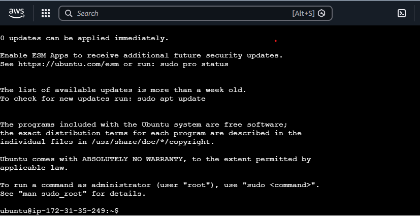

### System Update
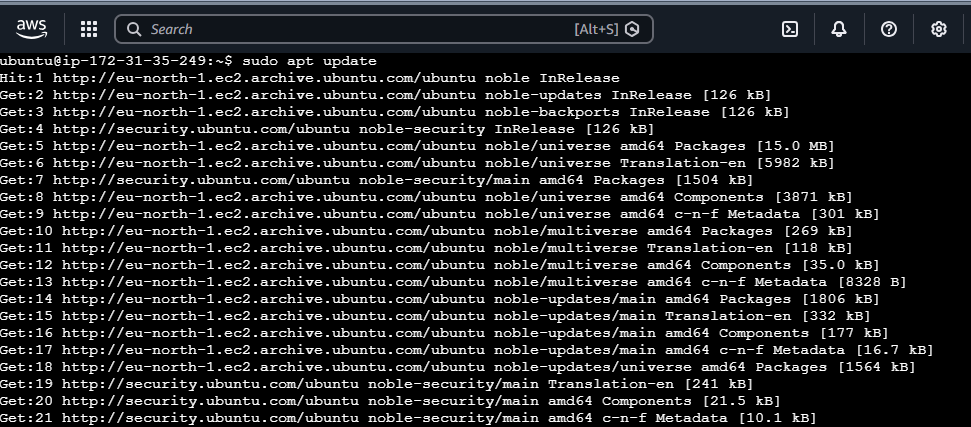

### Apache Installation
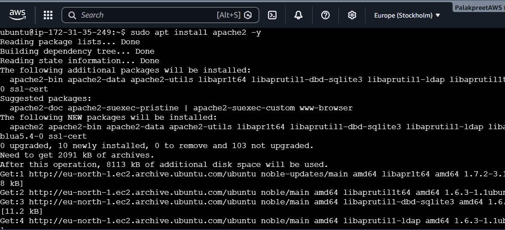

### Apache Running Status
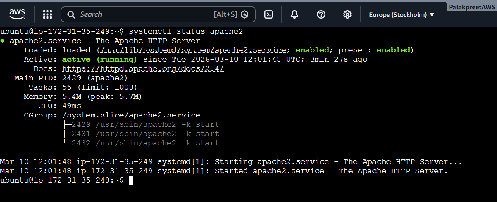

### Apache Default Web Page
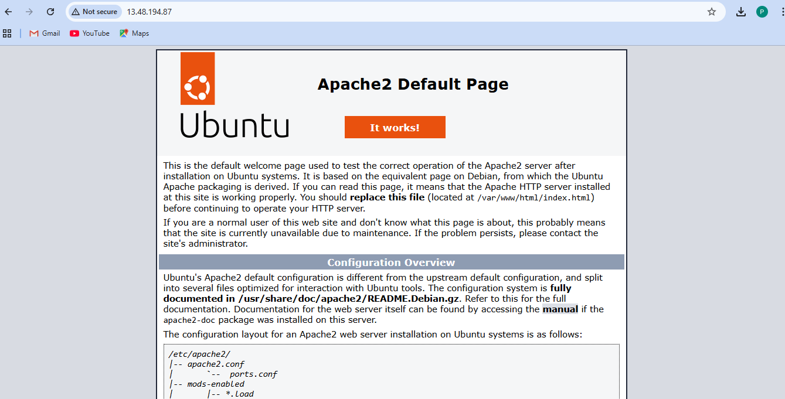

### Editing Index File
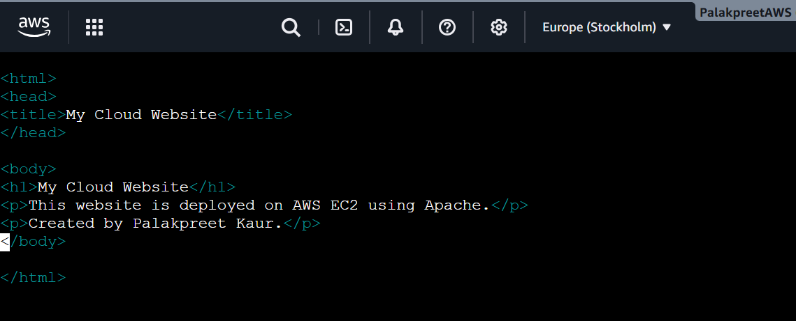

### Custom Website Page
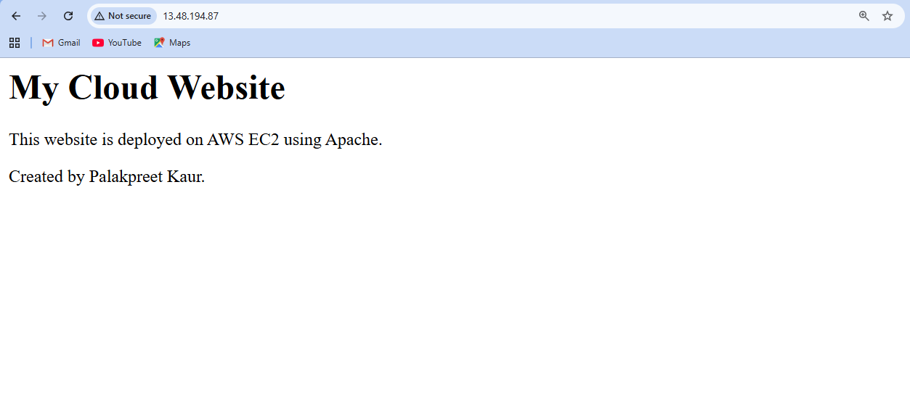

### Process Monitoring
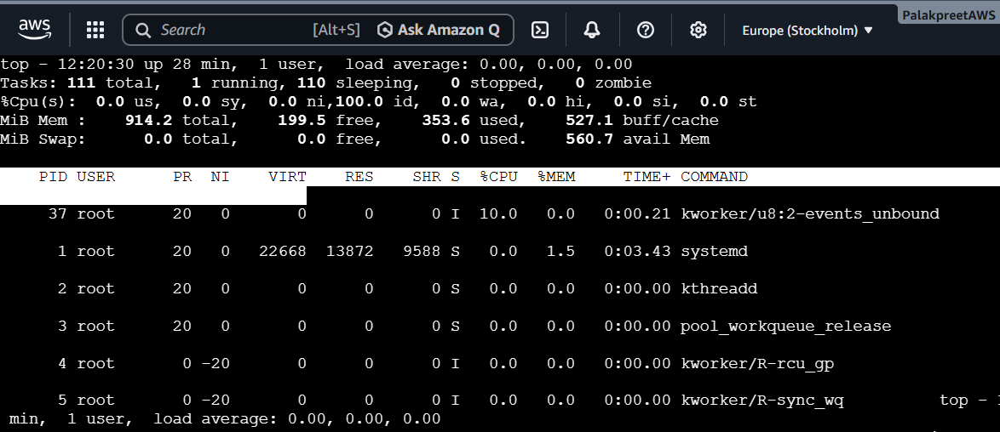

### Memory and Disk Usage
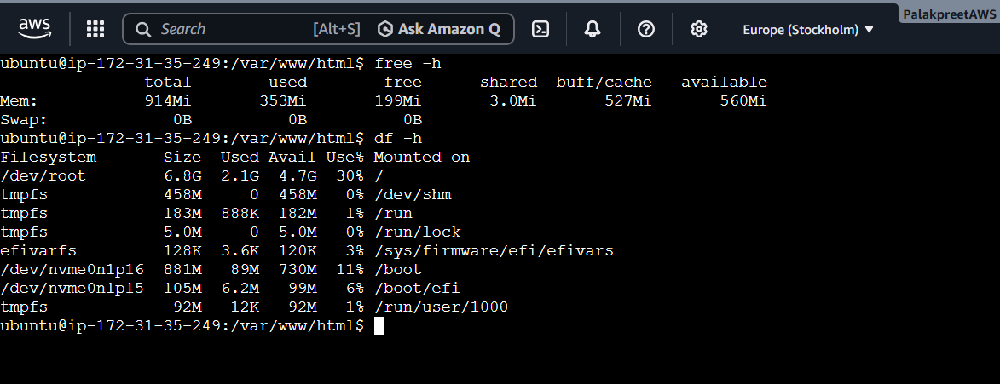

### Firewall Configuration
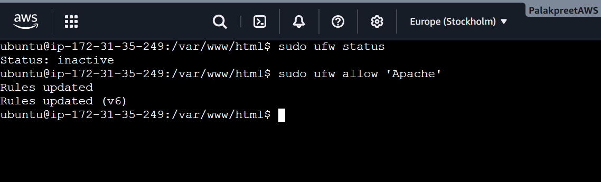

### Firewall Enabled
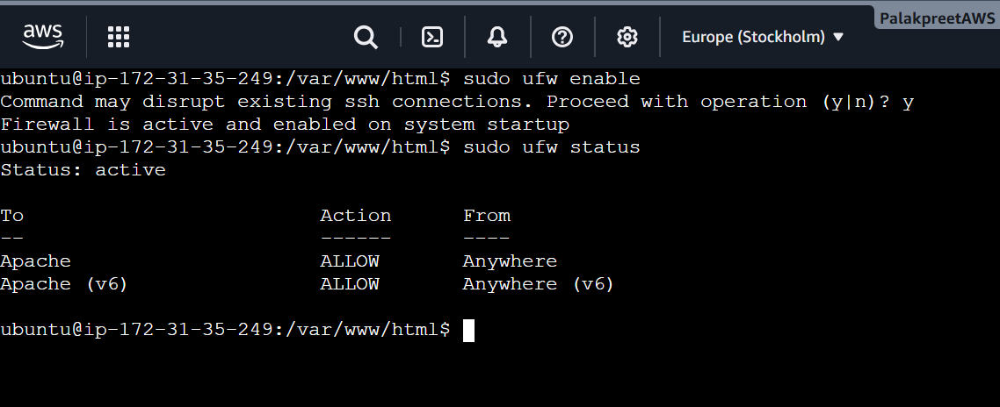

## Skills Demonstrated

- Cloud Infrastructure Deployment
- Linux Server Administration
- Web Server Installation and Configuration
- System Monitoring
- Firewall Configuration

## Conclusion

This project helped in understanding the basics of cloud server deployment, Linux command usage, and web server configuration using AWS EC2.

It demonstrates foundational skills required for cloud support and cloud engineering roles.
